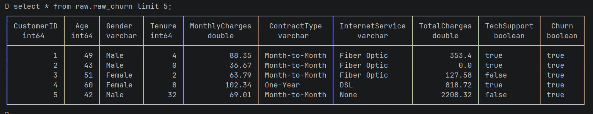
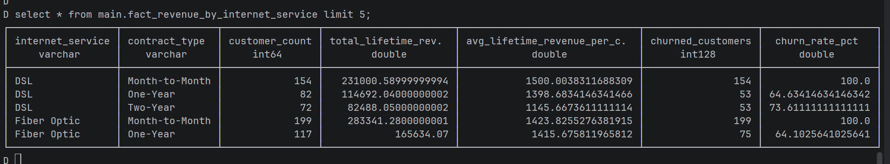
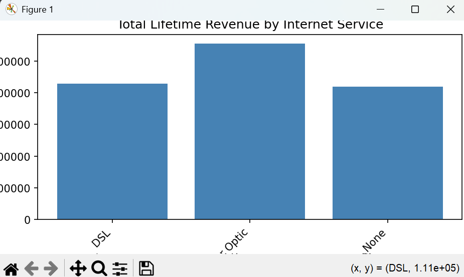

# Telecom Data ETL Pipeline (DuckDB + dbt + Airflow)

End‑to‑end local **telecom churn** analytics pipeline using:

- DuckDB as the local analytical database.
- dbt for modeling dimensions and facts.
- Optional Apache Airflow for orchestration.


---

## Prerequisites

- Python 3.11+
- Git
- dbt

---

## 1. Create Python virtual environment

From project root:
```
python3 -m venv .venv

.venv\Scripts\Activate.ps1
```

## 2. Install dependencies
```
pip install -r requirements.txt
```

## 3. Install  duckdb

- Download from https://duckdb.org/install/?platform=windows&environment=cli
- Extract to project root folder.

## 4. Load Raw Data to Staging database .
Create Databases "staging.db" and load raw data using python script staging.py

```
py .\scripts\staging.py
```
Check tables loaded by running below in PowerShell:
```
.\duckdb.exe data/staging/staging.db 


select * from information_schema.tables;
select * from raw.raw_churn limit 5;

```


##  5. Run dbt models
```
    cd dbt/telecom_data_etl
    dbt deps
    dbt run
```

##  6. Check tables loaded:
Go to project root :   
run below commands one by one to start db in the terminal
```
cd ../..     
.\duckdb.exe data/staging/staging.db 
```

Run SQL Queries: 
```
select * from information_schema.tables;
select * from main.dim_contract_type limit 5;
select * from main.dim_customer limit 5;
select * from main.dim_internet_service limit 5;
select * from main.fact_customer_revenue limit 5;
select * from main.fact_revenue_by_internet_service limit 5;
```



##  7. Reporting Visualisation

Exit from the databse by pressing CTL + X or C and execute below from project root directory
```
py .\scripts\reporting.py
```

